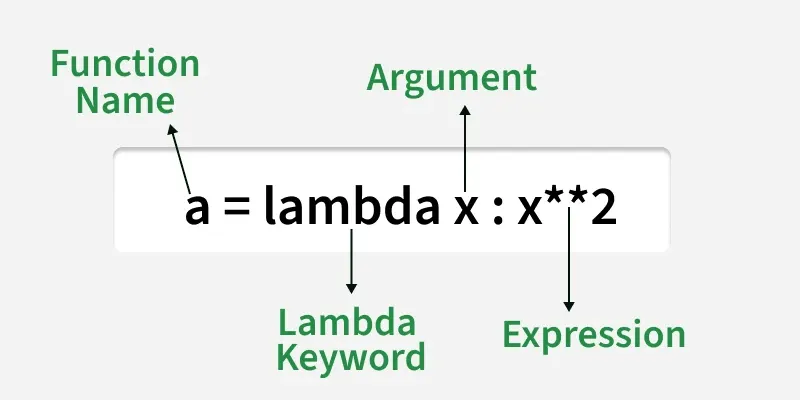
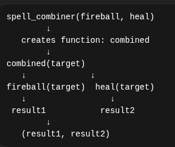
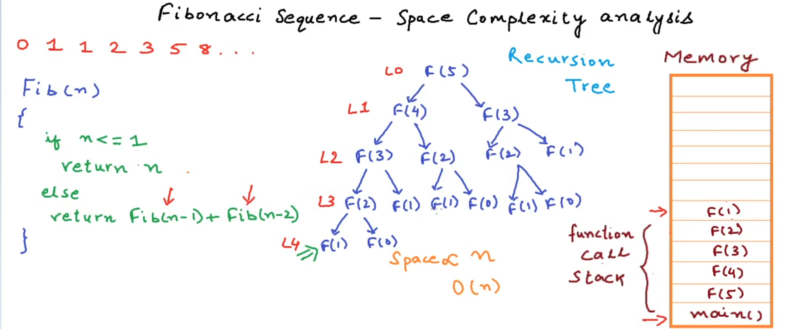

# 🐍 MOD_10 - Python Learning Notes

## 🎯 Key Concepts

### ⚡ Topic 1: Lambda Functions
- **Definition**: Lambda Functions
- **Key Points**:
  - ✨ Small anonymous functions with no defined name
  - 🎯 Temporary inline functions to pass simple logic
  - 📝 Syntax: `a = lambda x: x**2`
  
  - 🔍 **filter()** — uses lambda to filter items from a list
  - 🗺️ **map()** — applies lambda to each element and returns transformed list
  

- **Example Using List Comprehension**:
  ```python
  func = [lambda arg=x: arg * 10 for x in range(1, 5)]
  for i in func:
      print(i())
  ```
  📤 Output: `10, 20, 30, 40`

---

### 🚀 Topic 2: Higher Order Functions
- **Definition**: Functions that take or return other functions
- **Key Points**: 
  - 🎪 Takes another function as an argument **OR** returns another function **OR** both
  - 🏗️ In Python, functions are first-class citizens:
  - 📤 Pass as an argument
  - 📥 Return from another function
  - 💾 Store in a variable

- **Example via Visualization**:
  ```python
  def spell_combiner(spell1: Callable, spell2: Callable) -> Callable:
      def combined(*args, **kwargs) -> tuple:
          return (spell1(*args, **kwargs), spell2(*args, **kwargs))
      return combined

  def main() -> None:
      def fireball(target: str) -> str:
          return f"🔥 Fireball hits {target}"

      def heal(target: str) -> str:
          return f"💚 Heals {target}"

      combined: Callable = spell_combiner(fireball, heal)
      result: tuple = combined('Dragon')
      print(f"Combined spell result: {result[0]}, {result[1]}")
  ```
  

---

### 🧠 Topic 3: Memory Depths — Lexical Scoping & Closures
- **Definition**: Understanding variable scope in nested functions
- **Key Points**: 
  - 🌍 **Global variables** — accessible everywhere (use sparingly!)
  - 🏠 **Local variables** — defined within a function
  - 🔗 **Global keyword** — defines a global variable inside function
  - 🔐 **Nonlocal keyword** — access out-of-scope variables in nested functions

- **Example**:
  ```python
  def function() -> None:
      count: int = 0
      
      def function_two() -> None:
          nonlocal count  # ← Access outer scope
          count += 3
          return count
          
      return function_two
  ```

---

### 🛠️ Topic 4: Functools Treasures
- **Definition**: Mastering the functools module
- **Key Points**: 
  - 🔄 **reduce(function, list)** — repeatedly applies function to iterable
  - 📊 Example: `reduce(add, [1,2,3,4])` → `add(add(add(1,2),3),4)`. 
  -**functools.partial** locks in some arguements of a function ahead of time so we don'f have to pass them later. It does not call a function. instead it returns a new modified function. it's like, “I’m creating a shortcut version of this function.”
  -Use case: Used whenever we want to specialize a general function without rewriting it. lets say, we are sending emails and sender is always same and function we have:
  ```
  def send_email(sender, subject, body):
    ...
  ```
  so instead of repeating the sender(email) everywhere, we use partial function.
  - ** Example **:
  ```python
      from functools import partial
      def add(a, b):
        return a + b
      add_5 = partial(add, 5)
    #Now:
      add_5(10)  # → 15
    #Same as:
      add(5, 10)
  ```
  -**functools.lru_cache** reduces execution time of the function using memoization technique.
  ```Syntax:
    @lru_cache(maxsize=128, typed=False)

    Parameters:
    maxsize:This parameter sets the size of the cache, the cache can store upto maxsize most recent function calls, if maxsize is set to None, the LRU feature will be disabled and the cache can grow without any limitations
    typed:
    If typed is set to True, function arguments of different types will be cached separately. For example, f(3) and f(3.0) will be treated as distinct calls with distinct results and they will be stored in two separate entries in the cache
  ```
---

### 💎 Knowledge Recalls: Dictionary Lookups

> 🎯 **Golden Rule**: When checking for keys, use **hash-based lookup** — it's instant!

### ⚡ Hash-Based Lookup vs. Iteration

| Method | Speed | Type | Use Case |
|--------|-------|------|----------|
| `if key in dict` | ⚡ O(1) | Hash lookup | Check if key exists |
| `for k, v in dict.items()` | 🐌 O(n) | Iteration | Filter/transform dict |
| Dict comprehension | 🐌 O(n) | Iteration | Rebuild filtered dict |

### 🔍 How Hash-Based Lookup Works

1️⃣ **Hash Function**: Key → Hash value (number).  
2️⃣ **Memory Location**: Hash value determines where data lives.  
3️⃣ **Direct Access**: Python jumps directly to that location.  

**Why O(1)?**
- ✅ No looping needed
- ✅ Hash calculated once
- ✅ Direct memory access
- ✅ Same speed regardless of dict size

### 💻 Code Comparison

```python
# ⚡ FAST: Hash-based lookup O(1)
if operation not in operations:
    pass

# 🐌 SLOW: Linear search O(n)
next((v for k, v in operations.items() if operation == k), None)
# Has to check: is it "add"? No. is it "multiply"? No. is it "max"? Yes!
```

### ⚙️ Collision Handling
If two keys hash to the same value (rare), Python stores them in a list and compares directly — **still very fast!**


### Fibonacci sequence: Series of numbers. Each number is sum of two preceding ones. Fn = F(n-1) + F(n-2). eg:0, 1, 1, 2, 3, 5, 8, 13, 21, 34...
```python
@lru_cache(max_size=128)
def fib_with_cache(n):
    if n < 2:
        return n
    return fib_with_cache(n-1) + fib_with_cache(n-2)
```

### functools.singledispatch:  function perform operations regardless of any datatype. If we want a function to behave differently based on the argument type, this decorator allows us to write functions that dispatch operations based on the type of the argument.
---

## 📝 Exercises & Solutions

| Exercise | File | Objective |
|----------|------|-----------|
| 🔮 Lambda Spells | `ex0/lambda_spells.py` | Master lambda functions |
| 🚀 Higher Magic | `ex1/higher_magic.py` | Higher-order functions |
| 🔄 Scope Mysteries | `ex2/scope_mysteries.py` | Lexical scoping & closures |
| 🛠️ Functools Artifacts | `ex3/functools_artifacts.py` | Functools module |
| 🎲 Data Generator | `generator/data_generator.py` | Generators practice |

---